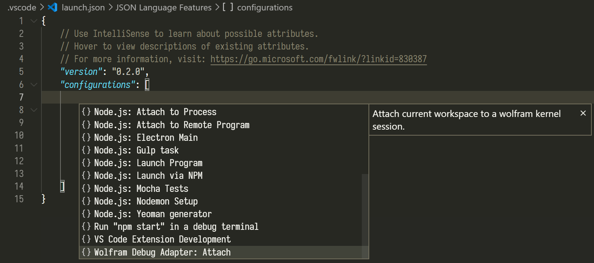

# Visual Studio Code Client for Wolfram Language Server

[](https://opensource.org/licenses/MIT)
[](https://github.com/kenkangxgwe/vscode-lsp-wl/releases)
[](https://marketplace.visualstudio.com/items?itemName=lsp-wl.lsp-wl-client)

<!-- markdown-toc start - Don't edit this section. Run M-x markdown-toc-refresh-toc -->
**Table of Contents**

- [Visual Studio Code Client for Wolfram Language Server](#visual-studio-code-client-for-wolfram-language-server)
    - [Installation](#installation)
    - [Client Settings](#client-settings)
        - [Language support](#language-support)
        - [Debugger support](#debugger-support)
    - [Language Server Features](#language-server-features)
        - [DocumentSymbol](#documentsymbol)
        - [Hover](#hover)
        - [Completion](#completion)
        - [Diagnostics](#diagnostics)
            - [Override Reporting Rules](#override-reporting-rules)
        - [Definition / References / Document Highlight](#definition--references--document-highlight)
        - [Code Action](#code-action)
        - [Document Color / Color Presentation](#document-color--color-presentation)
    - [Debug Adapter Features](#debug-adapter-features)
        - [Evaluate](#evaluate)
        - [Variables](#variables)
    - [Footnotes](#footnotes)

<!-- markdown-toc end -->

*Please be advised to git pull the lastest minor version __0.3.x__. There are some
breaking changes you want to know more in the server's
[README](https://github.com/kenkangxgwe/lsp-wl/blob/master/README.md).*

**Wolfram Language Server (WLServer)** is an implementation of the Microsoft's
[Language Server Protocol
(LSP)](https://microsoft.github.io/language-server-protocol) for [Wolfram
Language](http://www.wolfram.com/language). This server is
implemented in Wolfram Language itself.

This is the client-side code for VS Code, which is based on some slight
modifications of [Microsoft's LSP
example](https://github.com/Microsoft/vscode-extension-samples/tree/master/lsp-sample).
However, you still need to manually install the
[server](https://github.com/kenkangxgwe/lsp-wl) .

## Installation

0. [Wolfram Mathematica](http://www.wolfram.com/mathematica/) (11.2 or higher<a
    name="ref1"></a>[<sup>1</sup>](#footnote1)) or [Wolfram
    Engine](https://www.wolfram.com/engine/) (12.0 or higher).

1. Download the [server](https://github.com/kenkangxgwe/lsp-wl) from its
   repository.

    ```
    git clone https://github.com/kenkangxgwe/lsp-wl.git
    ```

2. Install the dependent paclets with the correct versions (currently 1.0 or
later) from the Wolfram kernel / Mathematica.
(_This will cost some time for the first time_) :  
    ``` mathematica
    PacletInstall["CodeParser"]
    PacletInstall["CodeInspector"]
    ```

3. Install the client extenstion from [Visual Studio Marketplace: Wolfram
Language Server](https://marketplace.visualstudio.com/items?itemName=lsp-wl.lsp-wl-client).

## Client Settings

### Language support

Once you have installed the extension, a few settings have to be done manually
in the client side to make things work.

After the extension is launched, go to **Preference -> Settings -> User Settings
-> Extensions -> Wolfram Language Server**, and configure the following options:

- **`Port`** **:** The client communicates with the server through port. Feel
  free to use any port that is not occupied by other processes.

- **`WLServer Path`** **:** The path to the server repository.

- **`Wolfram Path`** **:** The path of the `Wolfram` executable. (NOT `Mathematica` or `WolframKernel`)  
  For **Windows** users, the default path is `C:\Program Files\Wolfram
  Research\Mathematica\11.*\wolfram.exe`.  
  For **MaxOS** users, the default path is
  `/Applications/Mathematica.app/Contents/MacOS/wolfram`.  
  For **Linux** users, the default path is
  `/usr/local/Wolfram/Mathematica/11.*/wolfram`.
  
- **`Diagnostics: Mitigated`** and **`Diagnostics: Suppressed`** **:** To adjust
  how some of the diagnostics are reported, see [Diagnostics: Override Reporting
  Rules](#override-reporting-rules).

Restart VS Code to take effect.

### Debugger support

To enable debugger, you need to add the configuration to the project that you
are working on by clicking on **Run -> Add configuration...** in the menu. In
the opened `.vscode/launch.json` file, select `Wolfram Debug Adapter: Attach` in
the completion list.



Or add the following configuration directly to the `launch.json`.

```json
"configurations": [
    {
        "type": "dap-wl",
        "request": "attach",
        "name": "Create a new Wolfram Kernel",
        "stopOnEntry": true
    }
]
```

To start the debugger, jump to the `Run` tab in the sidebar and select the
configuration name just added and clicked the `Start Debugging` button.

## Language Server Features

### DocumentSymbol

You may typeset your package in the same way that Mathematica FrontEnd handles
it: a cell begins with two lines of comments, where the first line specifies the
style of the cell and the second line names it. So you may get the outline
structure of the file.

``` mathematica
(* ::Title:: *)
(*Title of the file*)

(* ::Section:: *)
(*Section 1*)
```


### Hover

Provide documentations for functions and variables from the ``System` ``
context, such as `String` and `$Path`, the `MessageName` and the special
numerical literals with `^^` or `*^`.


### Completion

The completion is shown by the client automatically. Functions and system
variables from the ``System` `` context that matches the input would be
displayed. To enter an unicode character, you may use the leader key
<kbd>\\</kbd> followed by the alias just like <kbd>esc</kbd> in Wolfram
FrondEnd. E.g., `<esc>a` in the FrontEnd is input as `\a` in the editor and the
server will show you the available completions.


**Completion Resolve:** Further information (such as documentation) would be
provided for the items in the list.


### Diagnostics

Syntax error would be underlined. This feature is powered by
[CodeParser](https://github.com/WolframResearch/codeparser) and
[CodeInspector](https://github.com/WolframResearch/codeinspector) paclets, thank
you [@bostick](https://github.com/bostick).


#### Override Reporting Rules

To adjust how some of the diagnostics are reported, adding their corresponding
tags in the
[`settings.json`](https://code.visualstudio.com/docs/getstarted/settings). There
are two kinds of ways to override the reporting rule:

- **`Mitigated`** **:** The tags under this category will not be considered as an issue,
and shown in the lowest severity, i.e. "hint". E.g. In VSCode, this will result
in a elipesis under the reporting position but will not listed under the
`Problems` tab.
- **`Suppressed`** **:** The tags under this category will be completely ignored and not
reported.

An example of configuration in `settings.json` is shown below:

``` json
{
    // ...
    "WolframLanguageServer.Diagnostics.mitigated": [
        "ExperimentalSymbol",
        "UnusedParameter",
        "UnusedVariable",
    ],
    "WolframLanguageServer.Diagnostics.suppressed": [
        "DifferentLine",
        "SuspiciousSessionSymbol",
    ],
    // ...
}
```

### Definition / References / Document Highlight

It is now able to look up the definition and references of a local variable in a
scope such as `Module` or pattern rules.


### Code Action

Code action is now able to,

- Open the documentation of system symbols in Mathematica (Not available for
  Wolfram Engine).  
  

- Evaluate the selected code if debugger is running. See [Evaluate](#evaluate).

### Document Color / Color Presentation

Both Named Colors and
Color Models with constant parameters are able to show and modify.  
(_Experimental, may have performance issues._)


This is under development, so more features are on the way. Notice that,
**syntax highlight** will NOT be provided as long as it is excluded in the LSP,
but there are already some good enough extensions written [by Flip
Phillips](https://marketplace.visualstudio.com/items?itemName=flipphillips.wolfram-language)
and
[by shigma](https://marketplace.visualstudio.com/items?itemName=shigma.vscode-wl).

## Debug Adapter Features

### Evaluate

Code evaluation can be run from the code action of the selection or code lens
below each section title. The results are usually shown in the debug console on
the editor side.


Expressions can also be directly input from the debug console.


### Variables

After evaluation, the symbol values can be retrieved from the editor. This
includes the own values of variables and the down/up/sub values of functions
defined.


The behavior of the variables mimics the workspace in MATLAB, so all the symbols
defined in the debug console as well as evaluated from the file will be
recorded. This also includes contexts other than ``Global` ``. The editor can
also watch on a specific expression after each evaluation if applicable.

## Footnotes

<a name="footnote1"> </a> **[1]** `SocketListen[]` is used for server-client
communication, which is introduced since 11.2. [^](#ref1)
